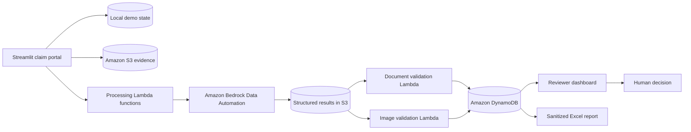

# AI-Assisted Vehicle Claims Review

An AWS-based reference implementation for motor-claim intake, document validation, multi-view vehicle-evidence assessment, and human review.

> **Reference implementation:** This repository demonstrates decision support for claims reviewers. It does not authenticate official documents, determine fraud, calculate repair costs, or approve or reject insurance claims automatically.

## Project overview

Vehicle claims often require reviewers to reconcile claim information, identity documents, driver credentials, vehicle registration records, and damage photographs. This project organizes those inputs into a structured workflow, applies configurable validation rules, and presents consolidated findings to a human reviewer.

All included records and document fixtures are fictional. The application must not be used with personal or production claim data without appropriate security, privacy, retention, and governance controls.

## Business problem

Manual initial review can be slow and inconsistent when evidence is incomplete, unreadable, expired, or contradictory. Reviewers need a clear way to identify missing information, compare extracted fields with claim records, evaluate whether submitted vehicle images are usable, and understand why a claim requires further review.

## Solution summary

The Streamlit application captures a claim package and uploads assessment inputs to Amazon S3. AWS Lambda functions coordinate processing, while Amazon Bedrock Data Automation can produce structured document and image results. Validation handlers consolidate those results, apply deterministic business rules, and store the review state in Amazon DynamoDB. A reviewer then inspects the findings and records the final human action.

The repository contains the application, AWS integration services, document and image validation handlers, report generation, synthetic fixtures, and tests. It does **not** contain a complete cloud deployment package or every upstream Bedrock invocation function.

## Key capabilities

- Guided claim intake with synthetic policy lookup
- Upload of KTP, SIM, STNK, and vehicle-damage evidence
- S3-based evidence routing and DynamoDB assessment state
- Field-level document validation and record matching
- Multi-view vehicle consistency checks
- Visible damage aggregation and severity reporting
- Configurable assessment thresholds
- Reviewer queues, findings, reasons, and human decisions
- Customer-safe claim status views
- Excel assessment report generation
- Optional local retrieval-augmented claims guidance

## Architecture and workflow



1. The user submits claim details and evidence.
2. The application saves local demonstration state and uploads the cloud assessment package.
3. Configured Lambda functions initiate document and vehicle-image processing.
4. Bedrock Data Automation writes structured outputs to S3.
5. Validation handlers apply completeness, confidence, matching, expiration, image-quality, consistency, and severity rules.
6. DynamoDB stores the consolidated assessment state.
7. A reviewer evaluates the evidence and records the final action.

See [Architecture](docs/ARCHITECTURE.md) for component boundaries and deployment gaps.

## Technology stack

| Area | Technology |
| --- | --- |
| User interface | Python, Streamlit |
| Cloud integration | AWS SDK for Python (Boto3) |
| Evidence storage | Amazon S3 |
| Assessment state | Amazon DynamoDB |
| Processing | AWS Lambda |
| Document and image extraction | Amazon Bedrock Data Automation |
| Local demonstration state | SQLite |
| Optional knowledge assistant | Ollama, ChromaDB |
| Reporting | OpenPyXL, XlsxWriter |
| Testing | Python `unittest`, synthetic fixtures |

## Repository structure

```text
.
├── app.py                          # Streamlit claim-intake entry point
├── pages/                          # Reviewer, status, and knowledge pages
├── services/                       # Local workflow and AWS adapters
├── lambdas/
│   ├── document_validation/        # Document package validation handler
│   └── image_validation/           # Multi-view image validation handler
├── rag/                            # Optional local retrieval pipeline
├── knowledge_base/                 # Sanitized claims guidance
├── scripts/                        # Data setup, fixtures, and report export
├── tests/                          # Unit tests and mock document fixtures
├── examples/                       # Fictional claim and result examples
├── docs/                           # Architecture, testing, and security notes
└── images/                         # Sanitized diagrams and screenshots only
```

## Setup and configuration

### Prerequisites

- Python 3.12
- AWS CLI credentials for your own account if cloud features will be used
- Access to the required S3, DynamoDB, Lambda, and Bedrock resources
- Ollama only if the optional knowledge assistant is enabled

### Local installation

```powershell
py -3.12 -m venv .venv
.\.venv\Scripts\Activate.ps1
python -m pip install --upgrade pip
python -m pip install -r requirements.txt
python -m scripts.initialize_database
```

Set the variables documented in [.env.example](.env.example) in your shell or deployment environment. The application does not automatically load `.env` files.

For example:

```powershell
$env:CLAIMS_AWS_REGION = "us-east-1"
$env:CLAIMS_AWS_BUCKET = "your-sanitized-bucket-name"
$env:CLAIMS_AWS_CLAIMS_TABLE = "your-claims-table"
streamlit run app.py
```

The example resource names are placeholders. Never commit AWS credentials or live resource identifiers.

### Optional knowledge assistant

Install and start Ollama, pull compatible chat and embedding models, then build the local index:

```powershell
python index_knowledge_base.py
```

The current RAG implementation expects its configured Ollama models to be available locally.

## Cloud prerequisites

The cloud path requires resources in the operator's AWS account:

- S3 buckets for claim inputs and structured results
- A DynamoDB table keyed by `claim_id`
- Lambda functions referenced by the application configuration
- A Bedrock Data Automation project and invocation workflow
- Least-privilege IAM permissions for the application and Lambda roles

Infrastructure-as-code and the upstream data-automation invocation functions are not included. The supplied validation handlers consume structured outputs and update the claim assessment record.

## Testing and validation

Run the automated service tests from the repository root:

```powershell
python -m unittest `
  tests.test_agent_claim_service `
  tests.test_aws_claim_resubmission `
  tests.test_aws_claim_service `
  tests.test_aws_claim_workflow_service `
  tests.test_claim_report_service `
  tests.test_claim_submission_service `
  tests.test_claim_workflow_service
```

Manual AWS and RAG diagnostics are documented in [tests/manual/README.md](tests/manual/README.md). They require operator-supplied configuration and are not part of the automated pass/fail suite.

The included document images are visibly labelled mock records. No real identity documents or customer evidence should be used as test fixtures.

See [Testing](docs/TESTING.md) for test boundaries and validation guidance.

## Design decisions

- **Human decision ownership:** automated outputs are recommendations and findings, not final insurance decisions.
- **Deterministic validation:** explicit thresholds and comparison rules interpret structured AI outputs.
- **Separated evidence and state:** binary evidence remains in S3 while assessment state is stored in DynamoDB.
- **Synthetic public fixtures:** public examples are fictional and visually marked as test data.
- **Hybrid demonstration:** SQLite supports the local interface while AWS services represent the assessment workflow.
- **Explicit integration boundary:** missing deployment and orchestration components are documented instead of simulated as implemented features.

See [Design decisions](docs/DESIGN_DECISIONS.md) for additional context.

## Error handling

- Input file types and required evidence are validated before submission.
- AWS SDK failures are surfaced as controlled workflow errors.
- Lambda handlers return per-claim results so partial failures can be identified.
- Missing or malformed structured outputs result in review findings rather than automatic approval.
- Report cells are protected against spreadsheet-formula injection.

## Security considerations

- Use environment variables and the standard AWS credential chain.
- Do not commit `.env`, Streamlit secrets, databases, outputs, claim files, or credentials.
- Apply least-privilege IAM policies to S3, DynamoDB, Lambda, and Bedrock resources.
- Encrypt claim data in transit and at rest in any non-demo environment.
- Introduce authentication, authorization, malware scanning, retention, deletion, audit, and consent controls before using non-synthetic data.
- Treat identity documents and vehicle evidence as sensitive personal data.

See [Security](docs/SECURITY.md) for the public-data rules used by this repository.

## Limitations

- The repository is a reference implementation, not a production claims platform.
- Cloud resources and Bedrock projects must be provisioned separately.
- Upstream Bedrock invocation functions are not included.
- No production authentication or role-based authorization is implemented.
- Thresholds are demonstration defaults and have not been calibrated on insurer-labelled data.
- Document extraction and image observations may be incorrect.
- Visible image damage does not establish repair cost, accident cause, liability, coverage, or fraud.
- The public fixtures do not represent the diversity and quality of real submissions.
- The optional local RAG component is separate from claim decision logic.

## Future improvements

- Add reviewed infrastructure-as-code for the documented AWS resources.
- Add contract tests for Bedrock Data Automation result schemas.
- Add authentication and reviewer role controls.
- Add durable orchestration, retries, dead-letter handling, and idempotency tests.
- Add sanitized end-to-end fixtures for every documented classification.
- Add observability dashboards and latency measurements.
- Add model and threshold evaluation using an authorized, representative dataset.
- Add an immutable assessment and reviewer-action audit trail.

See [Roadmap](docs/ROADMAP.md) for a prioritized version.

## Responsible use

This software is designed to support qualified reviewers. Do not use it to make fully automated eligibility, fraud, liability, coverage, or settlement decisions. Any operational implementation requires legal, privacy, security, risk, and claims-governance review.

## License

This project is licensed under the [MIT License](LICENSE).
