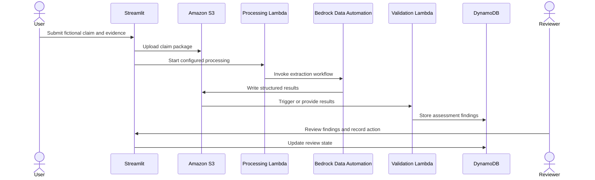

# Architecture

## Scope

This repository implements a hybrid demonstration of AI-assisted motor-claim review. Streamlit provides the claim and reviewer experience, local SQLite stores demonstration UI state, and AWS services hold evidence and assessment state.

## Component responsibilities

| Component | Responsibility |
| --- | --- |
| Streamlit application | Collect claim details and evidence, show status, and support reviewer actions |
| Local SQLite database | Store fictional policy and local demonstration workflow records |
| Amazon S3 | Store submitted evidence and structured assessment output |
| Processing Lambda functions | Start configured document and image processing workflows |
| Bedrock Data Automation | Produce structured extraction results from documents and images |
| Validation Lambda functions | Apply deterministic validation, consistency, and classification rules |
| Amazon DynamoDB | Store consolidated claim assessment state |
| Report exporter | Read DynamoDB and S3 results and produce a reviewer-oriented workbook |
| Optional local RAG service | Answer general claims-process questions from sanitized Markdown guidance |

## Processing sequence

## Repository boundary

Included:

- Streamlit application and pages
- Local workflow and AWS adapter services
- Document and image validation handlers
- Synthetic fixture generators
- Assessment report exporter
- Unit tests and sanitized guidance

Not included:

- AWS account or networking configuration
- Infrastructure-as-code
- Bedrock Data Automation project definitions
- Every upstream processing or event-routing Lambda function
- Production identity, access, monitoring, retention, or recovery controls

The missing components are deployment prerequisites, not hidden functionality.

## Data boundaries

Binary evidence is stored separately from structured assessment state. S3 holds claim inputs and model outputs. DynamoDB holds review-oriented fields and references to supporting results. Local SQLite supports the demonstration UI only and is excluded from Git.

## Human review boundary

Automated processing can extract information, compare records, flag inconsistencies, and recommend routing. A qualified reviewer remains responsible for any final action. The system does not establish fraud, liability, policy coverage, repair cost, or settlement value.
